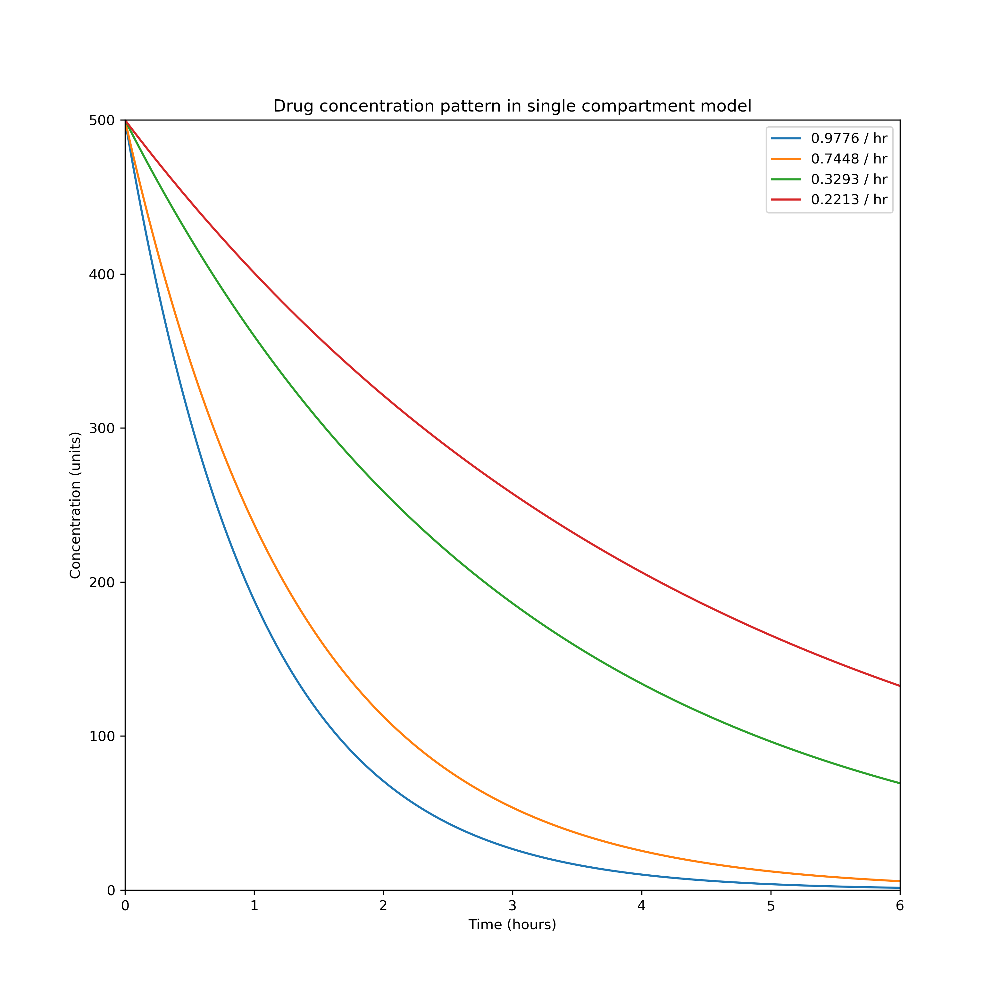
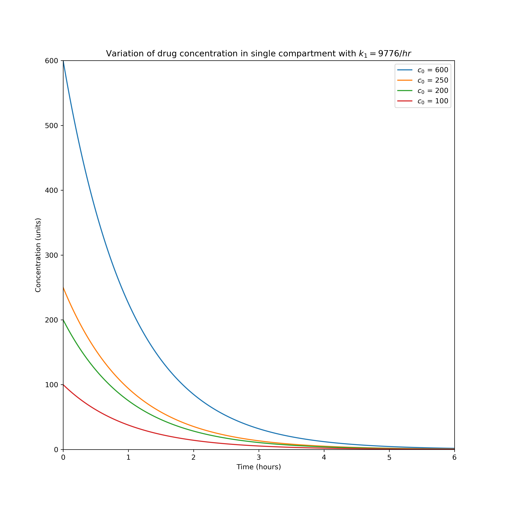
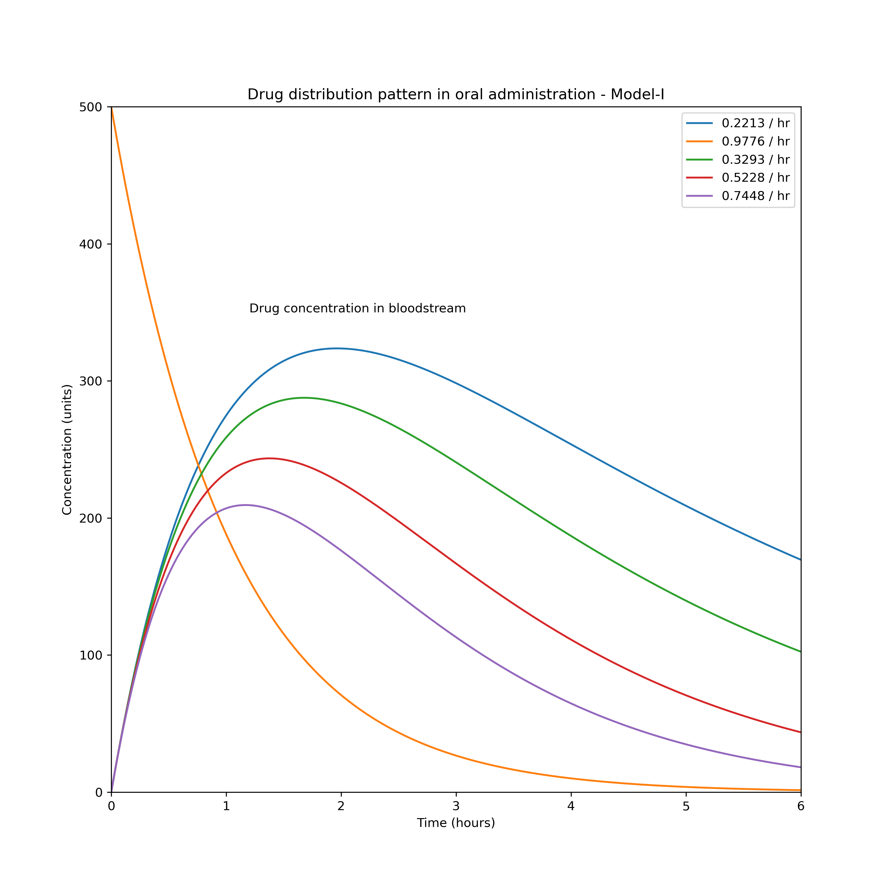
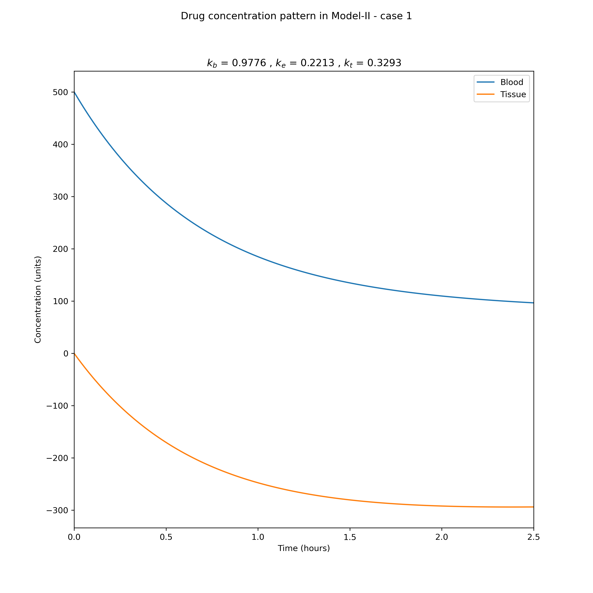
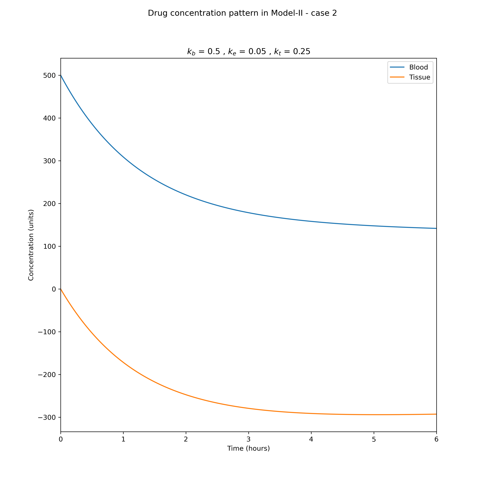
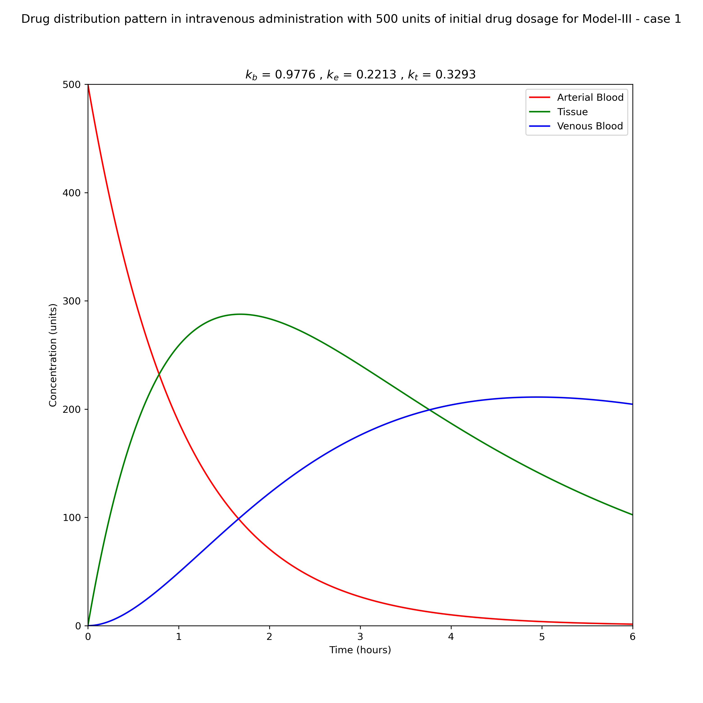
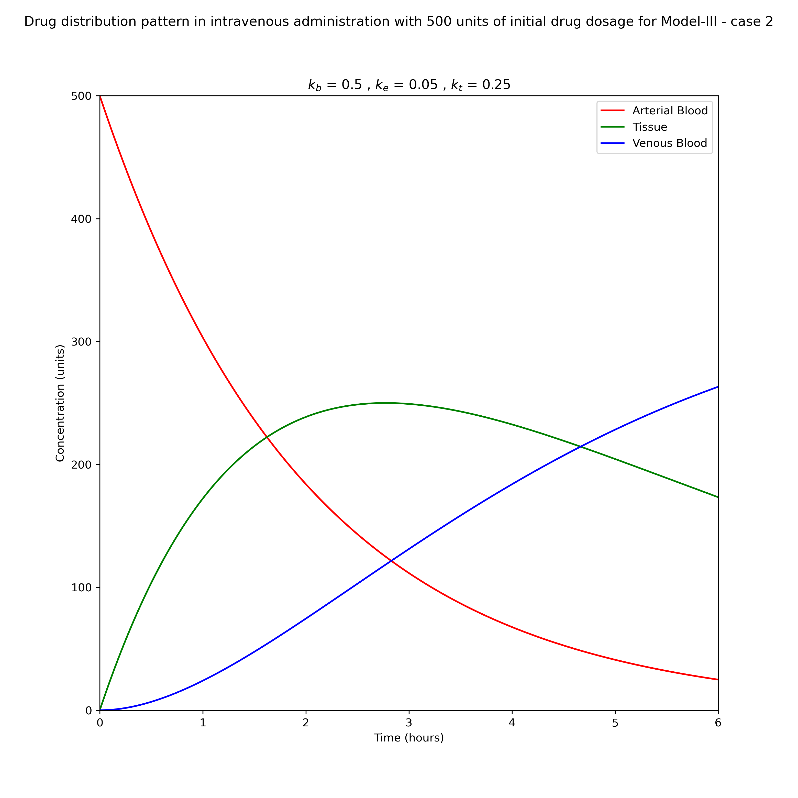

# Drug-Diffusion-Mathematical-Models

## Mathematical models for drug diffusion through the compartments of blood and tissue medium

### Abstract
This paper is an attempt to establish the mathematical models to understand the distribution of drug administration in human body through oral and intravenous routes. Three models were formulated based on diffusion process using Fick’s principle and law of mass action. The rate constants governing the law of mass action were used on the basis of the drug efficacy at different interfaces. The Laplace transform and eigenvalue methods were used to obtain the solution of the ordinary differential equations concerning the rate of change of concentration in different compartments viz. blood and tissue medium. The drug concentration in the different compartments has been computed using numerical parameters. The graphs plotted illustrate the variation of drug concentration with respect to time using MATLAB software. It has been observed from the graphs that the drug concentration decreases in the first compartment and gradually increases in other compartments.

---

### Results

#### Drug concentration in single compartment model

    

#### Variation of drug concentration in single compartment with k1 = 9776/hr

    

#### Drug distribution pattern in oral administration - Model-I

    

#### Drug concentration pattern in Model-II - case 1

    

#### Drug concentration pattern in Model-II - case 2

    

#### Drug distribution pattern in intravenous administration with 500 units of initial drug dosage for Model-III - case 1

    

#### Drug distribution pattern in intravenous administration with 500 units of initial drug dosage for Model-III - case 2

    

